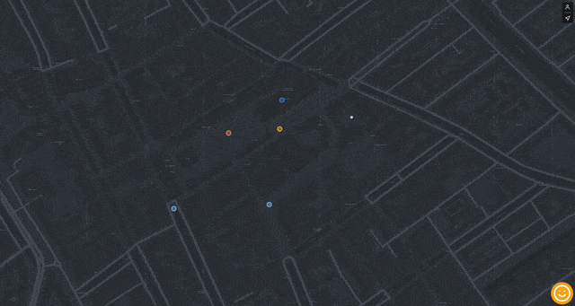

# bep

An MVP for my Bachelor Final Project. It is an application that aims to mitigate the effects of heat stress (that is often subjective) by allowing people to tell each other where the cool places in the area are.

## Stack

- Framework: [Nuxt 2](https://nuxtjs.org/)
- Mobile framework: [Capacitor](https://capacitorjs.com/)
- Deployment: [Vercel](https://vercel.com)
- Styling: [TailwindCSS](https://tailwindcss.com/)
- Database: [Supabase](https://supabase.com/)

## Development

| Command      | Action                                      |
| :----------- | :------------------------------------------ |
| `yarn`       | Installs dependencies                       |
| `yarn dev`   | Starts local dev server at `localhost:3000` |
| `yarn build` | Builds production site to `./dist/`         |
